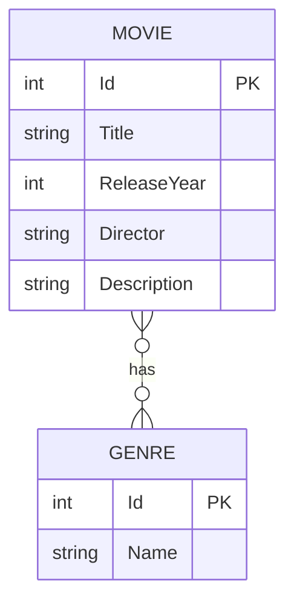

# MovieLogger

MovieLogger is a small REST API for logging and managing movies and genres.

This project is being rebuilt as a learning and refresher exercise, with a focus on modern .NET development, clean architecture, Git, AWS, and deployment practices.

## Technologies

- C# / .NET 10
- ASP.NET Core Web API
- Entity Framework Core
- SQLite
- AutoMapper
- Swagger / OpenAPI
- Git / GitHub

## Architecture

The solution is split into three projects:

- `MovieLogger.Api` - HTTP API, controllers and application entry point
- `MovieLogger.Service` - business logic, entities, DTOs and repository interfaces
- `MovieLogger.DAL` - data access, Entity Framework Core and SQLite

## Entity Relationship Diagram

## Current Features

- Create, read, update and delete movies
- Create, read, update and delete genres
- Associate movies with genres

## Status

Work in progress.
