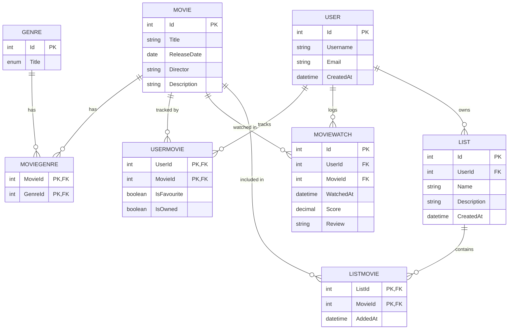

# MovieLogger

MovieLogger is a small REST API for logging and managing movies and genres.

This project is being rebuilt as a learning and refresher exercise, with a focus on modern .NET development, clean architecture, Git, AWS, and deployment practices.

## Technologies

- C# / .NET 10
- ASP.NET Core Web API
- Entity Framework Core
- SQLite
- AutoMapper
- Swagger / OpenAPI
- Git / GitHub

## Architecture

The solution is split into three projects:

- `MovieLogger.Api` - HTTP API, controllers and application entry point
- `MovieLogger.Service` - business logic, entities, DTOs and repository interfaces
- `MovieLogger.DAL` - data access, Entity Framework Core and SQLite

## Architecture Decision Records

Key architectural decisions are documented as ADRs in [`docs/adr`](docs/adr):

- [ADR-001: Use ASP.NET Core Web API](docs/adr/ADR-001-use-asp-net-core-web-api.md)
- [ADR-002: Use a Service layer](docs/adr/ADR-002-use-a-service-layer.md)
- [ADR-003: Use Entity Framework Core](docs/adr/ADR-003-use-entity-framework-core.md)
- [ADR-004: Use SQLite for local development](docs/adr/ADR-004-use-sqlite-for-local-development.md)
- [ADR-005: Use the Repository Pattern](docs/adr/ADR-005-use-the-repository-pattern.md)
- [ADR-006: Use a generic repository for common CRUD](docs/adr/ADR-006-use-a-generic-repository-for-common-crud.md)
- [ADR-007: Use specialised repositories for entity-specific queries](docs/adr/ADR-007-use-specialised-repositories-for-entity-specific-queries.md)
- [ADR-008: Keep repository abstractions in the Service layer](docs/adr/ADR-008-keep-repository-abstractions-in-the-service-layer.md)
- [ADR-009: Use AutoMapper](docs/adr/ADR-009-use-automapper.md)
- [ADR-010: Separate user movie status from movie watch history](docs/adr/ADR-010-separate-user-movie-status-from-movie-watch-history.md)

## Entity Relationship Diagram

## Current Features

- Create, read, update and delete movies
- Create, read, update and delete genres
- Associate movies with genres
- Create, read, update and delete users
- Mark movies as favourite/owned per user
- Log movie watches with a score and review, full CRUD
- Create, read, update and delete curated movie lists
- Add and remove movies from a list

## Status

Work in progress.
