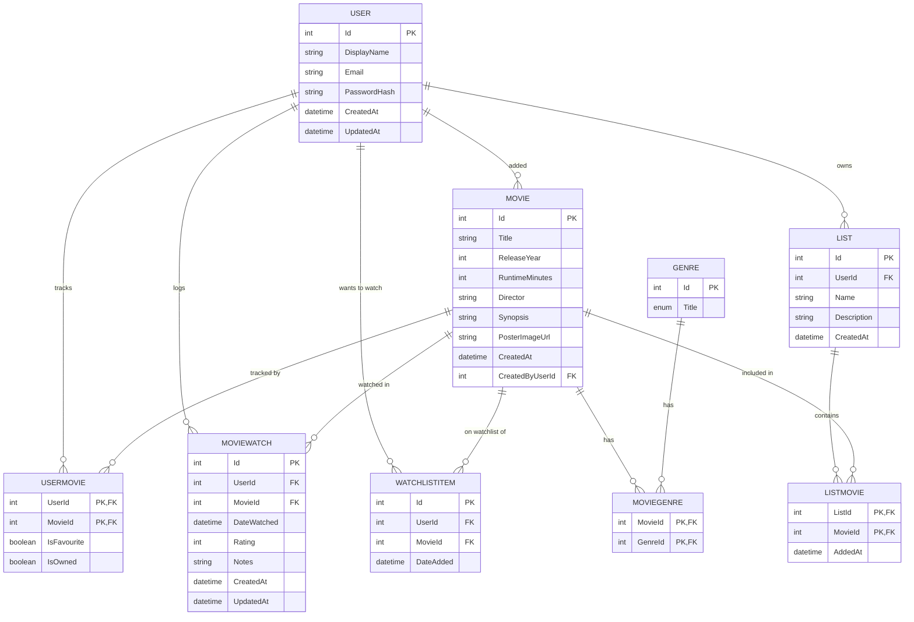

# MovieLogger

MovieLogger is a full-stack app for keeping a diary of the movies you watch: log each viewing with a rating and notes, keep a watchlist, and see your stats on a personal dashboard. It's an ASP.NET Core Web API backed by SQL Server, with a React + TypeScript frontend.

This project is being rebuilt as a learning and refresher exercise, with a focus on modern .NET development, clean architecture, Git, AWS, and deployment practices.

## Technologies

- C# / .NET 10
- ASP.NET Core Web API
- Entity Framework Core
- SQL Server
- Flyway
- AutoMapper
- JWT bearer authentication
- Swagger / OpenAPI
- xUnit, NSubstitute and `WebApplicationFactory` integration tests
- React, TypeScript, Vite, React Router and TanStack Query (frontend)
- Vitest and Testing Library (frontend tests)
- Git / GitHub

## Architecture

The solution is split into three projects:

- `MovieLogger.Api` - HTTP API, controllers and application entry point
- `MovieLogger.Service` - business logic, entities, DTOs and repository interfaces
- `MovieLogger.DAL` - data access, Entity Framework Core and SQL Server

The web frontend lives in [`client`](client): a React + TypeScript single-page app (Vite, React Router, TanStack Query) that talks to the API. See [`client/README.md`](client/README.md).

## Development

Common tasks run through the [`Makefile`](Makefile) in the repository root. You need the .NET 10 SDK, Node.js (with npm), GNU Make, a local SQL Server instance, and the Flyway CLI for migrations. On Windows, install GNU Make with `winget install --id ezwinports.make -e`. See [`docs/development.md`](docs/development.md) for full prerequisites and Windows setup.

| Command | What it does |
| --- | --- |
| `make help` | List every target with a short description |
| `make install-dependencies` | Install the frontend npm packages from the lockfile (`npm ci`) |
| `make database-migrate` | Apply pending Flyway migrations to the local database |
| `make start-api` | Start the API on http://localhost:5021 |
| `make start-frontend` | Start the Vite dev server on http://localhost:5173 |
| `make start-dev` | Start the API and frontend together; Ctrl+C stops both |
| `make build-api` / `make build-frontend` | Build the .NET solution / the production frontend |
| `make test-api` | Run all .NET tests: service unit tests and API integration tests |
| `make test-frontend` | Run the frontend Vitest suite |
| `make test-all` | Run the backend and frontend tests |
| `make verify-project` | Full check: backend build, backend tests, frontend tests, frontend build |
| `make clean` | Remove build output (.NET build output and `client/dist`) |

## Database Migrations

Database schema creation, schema changes, and migration history are managed by Flyway, not EF Core. Migration files live in [`database/migrations`](database/migrations); see [`docs/migrations.md`](docs/migrations.md) for how to install Flyway and run migrations locally, and [ADR-012](docs/adr/ADR-012-use-flyway-for-schema-migrations.md) for why.

## Testing

The solution has service-layer unit tests (`MovieLogger.Service.Tests`) and API integration tests (`MovieLogger.Api.Tests`). The integration tests exercise the real HTTP pipeline, including JWT authentication, against a throwaway SQL Server database built from the Flyway migrations. Run them all with `make test-api` (or `dotnet test MovieLogger.slnx`). The frontend has its own Vitest suite: run `make test-frontend` (or `npm test` from `client/`). `make verify-project` builds and tests both. See [`docs/testing.md`](docs/testing.md) for the local SQL Server requirements and how test isolation works.

## Architecture Decision Records

Key architectural decisions are documented as ADRs in [`docs/adr`](docs/adr):

- [ADR-001: Use ASP.NET Core Web API](docs/adr/ADR-001-use-asp-net-core-web-api.md)
- [ADR-002: Use a Service layer](docs/adr/ADR-002-use-a-service-layer.md)
- [ADR-003: Use Entity Framework Core](docs/adr/ADR-003-use-entity-framework-core.md)
- [ADR-004: Use SQLite for local development](docs/adr/ADR-004-use-sqlite-for-local-development.md) (superseded by ADR-011)
- [ADR-005: Use the Repository Pattern](docs/adr/ADR-005-use-the-repository-pattern.md)
- [ADR-006: Use a generic repository for common CRUD](docs/adr/ADR-006-use-a-generic-repository-for-common-crud.md)
- [ADR-007: Use specialised repositories for entity-specific queries](docs/adr/ADR-007-use-specialised-repositories-for-entity-specific-queries.md)
- [ADR-008: Keep repository abstractions in the Service layer](docs/adr/ADR-008-keep-repository-abstractions-in-the-service-layer.md)
- [ADR-009: Use AutoMapper](docs/adr/ADR-009-use-automapper.md)
- [ADR-010: Separate user movie status from movie watch history](docs/adr/ADR-010-separate-user-movie-status-from-movie-watch-history.md)
- [ADR-011: Use SQL Server for local development](docs/adr/ADR-011-use-sql-server-for-local-development.md)
- [ADR-012: Use Flyway for schema migrations](docs/adr/ADR-012-use-flyway-for-schema-migrations.md)
- [ADR-013: Use JWT bearer authentication](docs/adr/ADR-013-use-jwt-bearer-authentication.md)
- [ADR-014: Use a dedicated SQL Server database for API integration tests](docs/adr/ADR-014-use-a-dedicated-sql-server-database-for-api-integration-tests.md)

## Entity Relationship Diagram


```mermaid
erDiagram
    USER {
        int Id PK
        string DisplayName
        string Email
        string PasswordHash
        datetime CreatedAt
        datetime UpdatedAt
    }
    MOVIE {
        int Id PK
        string Title
        int ReleaseYear
        int RuntimeMinutes
        string Director
        string Synopsis
        string PosterImageUrl
        datetime CreatedAt
        int CreatedByUserId FK
    }
    GENRE {
        int Id PK
        enum Title
    }
    MOVIEGENRE {
        int MovieId PK,FK
        int GenreId PK,FK
    }
    USERMOVIE {
        int UserId PK,FK
        int MovieId PK,FK
        boolean IsFavourite
        boolean IsOwned
    }
    MOVIEWATCH {
        int Id PK
        int UserId FK
        int MovieId FK
        datetime DateWatched
        int Rating
        string Notes
        datetime CreatedAt
        datetime UpdatedAt
    }
    WATCHLISTITEM {
        int Id PK
        int UserId FK
        int MovieId FK
        datetime DateAdded
    }
    LIST {
        int Id PK
        int UserId FK
        string Name
        string Description
        datetime CreatedAt
    }
    LISTMOVIE {
        int ListId PK,FK
        int MovieId PK,FK
        datetime AddedAt
    }

    MOVIE ||--o{ MOVIEGENRE : "has"
    GENRE ||--o{ MOVIEGENRE : "has"
    USER ||--o{ USERMOVIE : "tracks"
    MOVIE ||--o{ USERMOVIE : "tracked by"
    USER ||--o{ MOVIEWATCH : "logs"
    MOVIE ||--o{ MOVIEWATCH : "watched in"
    USER ||--o{ WATCHLISTITEM : "wants to watch"
    MOVIE ||--o{ WATCHLISTITEM : "on watchlist of"
    USER ||--o{ MOVIE : "added"
    USER ||--o{ LIST : "owns"
    LIST ||--o{ LISTMOVIE : "contains"
    MOVIE ||--o{ LISTMOVIE : "included in"
```

## Current Features

- Create, read, update and delete movies
- Create, read, update and delete genres
- Associate movies with genres
- View, update and delete your own user account
- Mark movies as favourite/owned per user
- Create, read, update and delete curated movie lists
- Add and remove movies from a list
- Register and log in with JWT-based authentication
- Search the shared movie catalogue by title, director or year (paginated)
- Log a movie as watched, including multiple viewings of the same movie, with a 1-5 star rating and notes
- Maintain a personal watchlist, separate from watched history
- View a personal dashboard (totals, this month, average rating, top genres, recently watched)

## Frontend Design

Frontend design files for MovieLogger live in [`docs/design`](docs/design):

- [`MovieLogger.fig`](docs/design/MovieLogger.fig) - Figma source file
- [`MovieLogger.pdf`](docs/design/MovieLogger.pdf) - exported design PDF

The live Figma project can be viewed at [figma.com/design/txQSSUkel3HzXqIzAmP68n/MovieLogger](https://www.figma.com/design/txQSSUkel3HzXqIzAmP68n/MovieLogger?node-id=0-1&p=f&m=draw).

## Running the Frontend

The quickest way is `make start-dev`, which starts the API and the web app together. To do it by hand, with the API running locally (`dotnet run --project server/src/MovieLogger.Api --launch-profile http`), start the web app from `client/`:

```
npm install
npm run dev
```

Then open http://localhost:5173. The dev server proxies `/api` to the API, so no CORS setup is needed. See [`client/README.md`](client/README.md) for configuration, authentication and testing details.

## Status

Work in progress.
